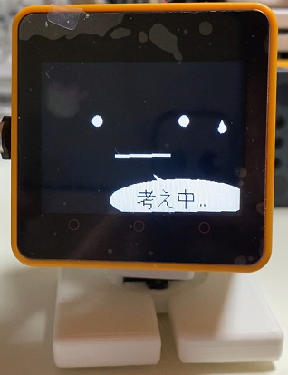

# AI_StackChan2-multilingual

This project is a fork of AI_StackChan2 by GitHub user robo8080. The original project is located at:
https://github.com/robo8080/AI_StackChan2. This is based on AI_StackChan2 as forked on 2023-11-30.

The goals of this project are simple:
1) Parameterize/modularize settings to allow for multiple languages, not just Japanese.
   At first, we'll support just 'ja' (Japanese) and 'en-US' (English, US).

   This should include all utterances by the robot, all texts written on screen, and
   the primary documentation (comments are of lesser importance).

2) Parameterize/modularize additional settings to improve flexibility. Ideally, as many
   settings as possible should be able to be set via files located on the robot's microSD
   card. These settings should be well documented.

(The following has been adapted from a Google Translate translation of the original Japanese README)

This is AI Stack Chan 2.
  

  

Features of AI Stack Chan 2 

* Use the web version VOICEVOX for speech synthesis.
* You can select either "Google Cloud STT" or "OpenAI Whisper" for voice recognition.
 

Google Cloud STT was based on "MhageGH"'s [esp32_CloudSpeech](https://github.com/MhageGH/esp32_CloudSpeech/ "Title"). thank you very much.  
We would like to thank "Inaba" and "kobatan" for their great advice in making "OpenAI Whisper" usable.  
For the wake word, I used "MechaUma"'s [SimpleVox](https://github.com/MechaUma/SimpleVox/ "Title") library.

---

### What you need to make the M5GoBottom version Stack Chan body and how to make it ###
See here.  
* [Stackchan M5GoBottom version assembly kit](https://raspberrypi.mongonta.com/about-products-stackchan-m5gobottom-version/ "Title") 

### What you need to build the program ###
* [M5Stack Core2](http://www.m5stack.com/ "Title") 
* VSCode 
* PlatformIO 

Please refer to "platformio.ini" for the libraries used.  

~[As of 5/31, it does not work with CoreS3 due to a problem with M5Unified. 】~~ 

---

### Setting GPIO number using servo motor ###
* Set the GPIO number that uses the servo motor near line 46 of main.cpp.

### How to use ###

See here.  

* [AI_StackChan2_README](https://github.com/robo8080/AI_StackChan2_README/ "Title") 

----------------------------------------------------------

以下は 2023 年 11 月 30 日時点の日本語の README です。

AIｽﾀｯｸﾁｬﾝ2です。
  

  

AIｽﾀｯｸﾁｬﾝ2の特徴 

* 音声合成にWeb版 VOICEVOXを使います。
* 音声認識に"Google Cloud STT"か"OpenAI Whisper"のどちらかを選択できます。
 

Google Cloud STTは、”MhageGH”さんの [esp32_CloudSpeech](https://github.com/MhageGH/esp32_CloudSpeech/ "Title") を参考にさせて頂きました。ありがとうございました。 
"OpenAI Whisper"が使えるようにするにあたって、多大なご助言を頂いた”イナバ”さん、”kobatan”さんに感謝致します。 
ウェイクワードには、”MechaUma”さんの[SimpleVox](https://github.com/MechaUma/SimpleVox/ "Title")ライブラリを使わせていただきました。

---

### M5GoBottom版ｽﾀｯｸﾁｬﾝ本体を作るのに必要な物、及び作り方 ###
こちらを参照してください。 
* [ｽﾀｯｸﾁｬﾝ M5GoBottom版組み立てキット](https://raspberrypi.mongonta.com/about-products-stackchan-m5gobottom-version/ "Title") 

### プログラムをビルドするのに必要な物 ###
* [M5Stack Core2](http://www.m5stack.com/ "Title") 
* VSCode 
* PlatformIO 

使用しているライブラリ等は"platformio.ini"を参照してください。 

~~【5/31の時点ではM5Unifiedの不具合の為、CoreS3では動きません。】~~ 

---

### サーボモーターを使用するGPIO番号の設定 ###
* main.cppの46行目付近、サーボモーターを使用するGPIO番号を設定してください。

### 使い方 ###

こちらを参照してください。 

* [AI_StackChan2_README](https://github.com/robo8080/AI_StackChan2_README/ "Title") 
 
 
 
